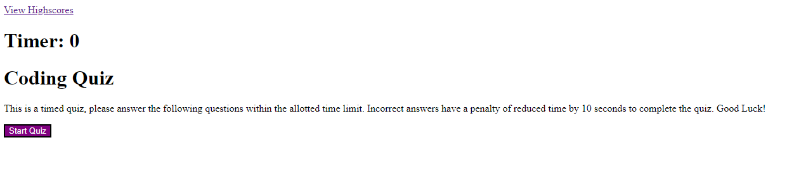

# Employee-Code-Quiz

## Description
In this project we created a timed quiz where the timer would start once the "Start Quiz" button is clicked and the first question would pop up. If a question is answered incorrectly, the time limit is reduced by 5 seconds as a penalty. Once all the questions have been answered or the timer reaches zero, the quiz is ended and the user is prompted to ender their initials in order to log their score and there is an option to try again. 

[Deployed Site](https://angi-adema.github.io/Employee-Code-Quiz/)

## Acceptance Criteria
GIVEN I am taking a code quiz
WHEN I click the start button
THEN a timer starts and I am presented with a question
WHEN I answer a question
THEN I am presented with another question
WHEN I answer a question incorrectly
THEN time is subtracted from the clock
WHEN all questions are answered or the timer reaches 0
THEN the game is over
WHEN the game is over
THEN I can save my initials and my score
